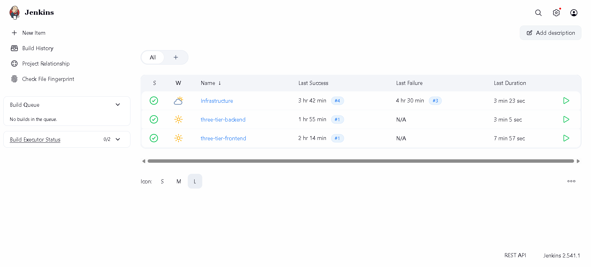
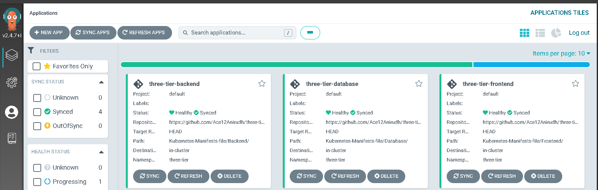

# 🚀 Three-Tier MERN Stack Deployment on AWS EKS

    

A production-grade implementation of a **Three-Tier MERN Application** (MongoDB, Express, React, Node.js) deployed on **AWS Elastic Kubernetes Service (EKS)**. This project demonstrates a complete **DevSecOps** pipeline using **Terraform** for Infrastructure as Code (IaC), **Jenkins** for CI, and **ArgoCD** for GitOps-based CD.

---

## 🏗️ Architecture

This project simulates a real-world enterprise environment where resources are restricted, requiring hybrid automation and manual configuration strategies.

### High-Level Flow
1.  **Infrastructure:** Terraform provisions the VPC, EKS Cluster, and Private Node Groups (Spot & On-Demand).
2.  **CI Pipeline:** Jenkins authenticates with AWS, validates Terraform code, and applies infrastructure changes.
3.  **CD Pipeline:** ArgoCD watches the GitHub manifest repository and syncs changes to the EKS cluster.
4.  **Networking:** Due to SCP (Service Control Policy) restrictions on the AWS account, an **Application Load Balancer (ALB)** is manually configured to route traffic to **NodePort** services on Private Nodes.


---

## 📹 Project Demo

Watch the full end-to-end deployment and workflow in action.

[](https://drive.google.com/file/d/1D5dio3OGbl1CRGfGAQtTBWevr8S6k0RZ/view?usp=drive_link)

> *Click the image above to watch the video.*

---

## 🛠️ Tech Stack & Tools

| Category | Tools Used |
| :--- | :--- |
| **Cloud Provider** |  (EKS, VPC, EC2, ALB, ECR, IAM) |
| **IaC** |  |
| **Containerization** |  |
| **Orchestration** |  |
| **CI / CD** |   |
| **Frontend** | React.js |
| **Backend** | Node.js & Express.js |
| **Database** | MongoDB (StatefulSet) |

---

## 📂 Project Structure

```bash
├── eks/                      # Terraform Configuration
│   ├── main.tf               # Provider & Backend definitions
│   ├── vpc.tf                # Network infrastructure
│   ├── eks-cluster.tf        # Control Plane setup
│   ├── node-groups.tf        # Spot & Private Node Groups
│   └── variables.tf
├── Kubernetes-Manifests-file/# K8s YAMLs (GitOps Source)
│   ├── Frontend/             # React Deployment & Service
│   ├── Backend/              # Node API Deployment & Service
│   ├── Database/             # MongoDB StatefulSet & Secrets
│   └── ingress.yaml          # Ingress Rules (If policy allows)
├── Jenkinsfile               # CI Pipeline (Terraform Stages)
└── README.md
```

---

## ⚙️ Deployment Strategy

### 1. Infrastructure as Code (Terraform)
The infrastructure is fully automated. The `Jenkinsfile` defines stages to Initialize, Validate, Plan, and Apply Terraform configurations.

**Pipeline Stages:**
* `Clean Workspace`: Removes stale state files.
* `Git Checkout`: Pulls the latest code.
* `Terraform Init`: Initializes AWS provider.
* `Terraform Validate`: Checks syntax.
* `Terraform Action`: Runs `plan`, `apply`, or `destroy` based on user input parameters.

### 2. The "Private Node" Networking Challenge
**Scenario:** The EKS nodes are deployed in **Private Subnets** for security. Furthermore, the AWS Organization enforced a **Service Control Policy (SCP)** blocking the automated creation of Load Balancers via the Kubernetes Ingress Controller.

**Solution Implemented:**
* **Services:** Converted Frontend (`30007`) and Backend (`30008`) services to `NodePort` type.
* **Manual ALB:** Created an AWS Application Load Balancer manually.
* **Target Groups:** Configured Target Groups pointing to both **Spot** and **On-Demand** instances on ports `30007` and `30008`.
* **Security Groups:** Allowed traffic from the ALB Security Group to the Node Security Group.

---

## 🚀 How to Run

### Prerequisites
* AWS Account with Admin Access (or sufficient permissions).
* Jenkins Server installed with AWS & Terraform plugins.
* `kubectl` and `aws-cli` configured locally.

### Step 1: Clone the Repository
```bash
git clone [https://github.com/Ace12Anirudh/three-tier-mernapp-deploy.git](https://github.com/Ace12Anirudh/three-tier-mernapp-deploy.git)
cd three-tier-mernapp-deploy
```

### Step 2: Configure Jenkins
1.  Create a **Pipeline** project.
2.  Link it to this GitHub repository.
3.  Add AWS Credentials (`aws-creds`) in Jenkins Global Credentials.
4.  Run the pipeline with parameter `Action = apply`.

### Step 3: Deploy Kubernetes Manifests (ArgoCD)
1.  Install ArgoCD on the cluster.
2.  Connect ArgoCD to the `Kubernetes-Manifests-file/` directory of this repo.
3.  Enable **Auto-Sync** and **Prune**.

### Step 4: Configure Networking (If Ingress is Blocked)
* **Update Frontend Deployment:** Set `REACT_APP_BACKEND_URL` to your ALB DNS name.
* **Create Target Groups:** Point them to ports `30007` (Frontend) and `30008` (Backend).
* **Update Security Groups:** Allow Traffic `ALB SG -> Node SG`.

---

## 📸 Screenshots

| Jenkins Pipeline | ArgoCD Sync |
| :---: | :---: |
|  |  |

---

## 🔮 Future Enhancements
* [ ] Implement **Helm Charts** for better manifest management.
* [ ] Integrate **Prometheus & Grafana** for monitoring.
* [ ] Automate the ALB creation using **Terraform** (bypassing the Controller issue).
* [ ] Implement **Network Policies** for tighter security between pods.

---

## 🤝 Contributors
* **Aman Pathak** - *DevOps Engineer* - [GitHub Profile](https://github.com/Ace12Anirudh)

---

### 📄 License
This project is licensed under the MIT License - see the [LICENSE](LICENSE) file for details.